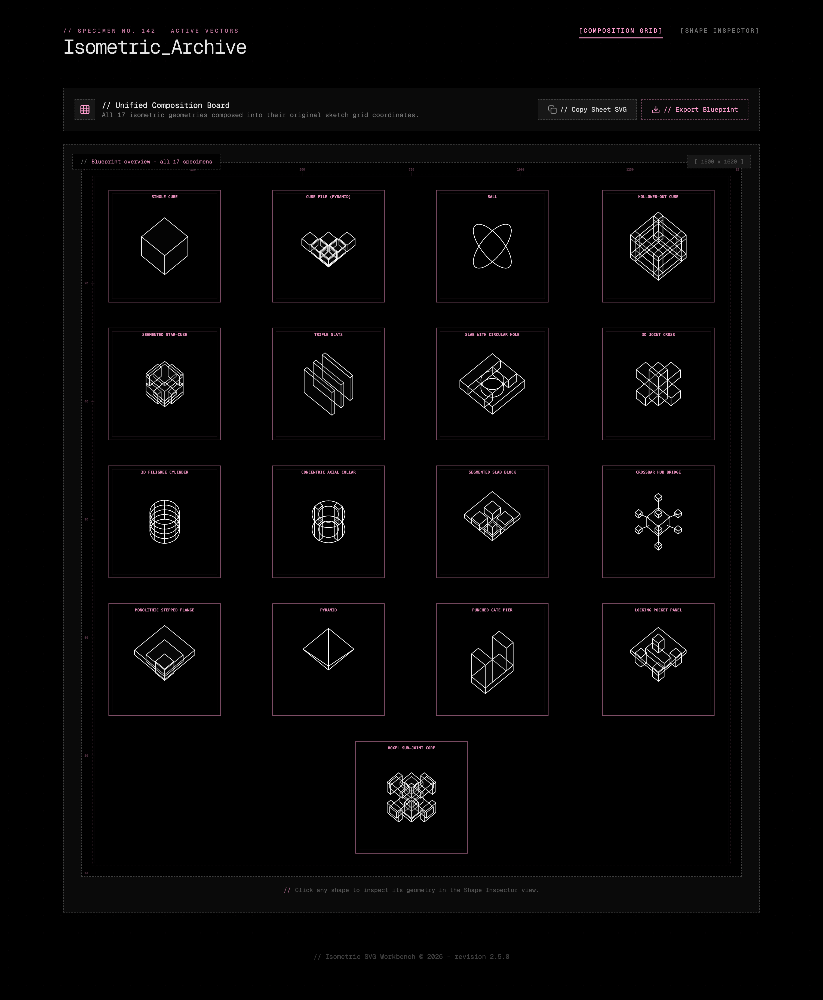
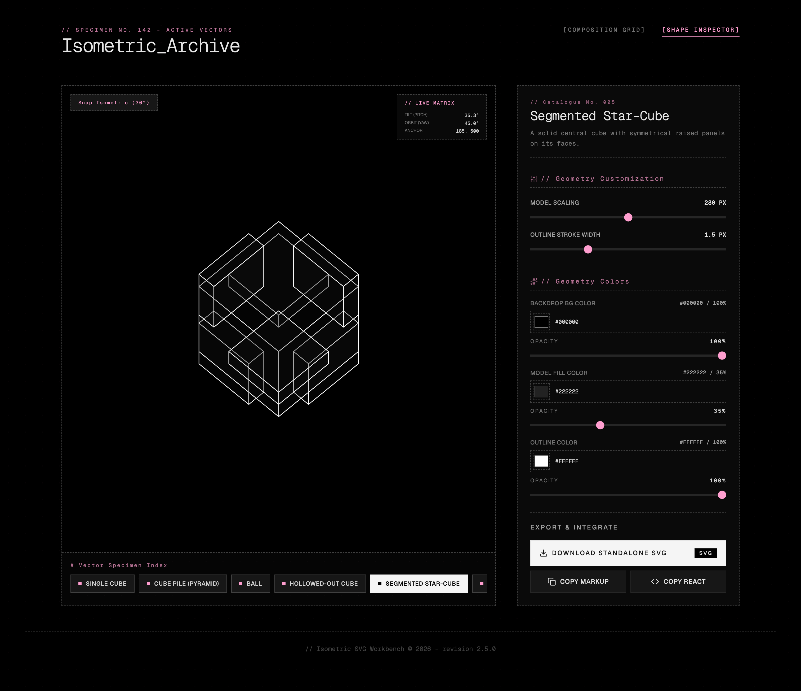

# Isometric SVG Workbench

Isometric SVG Workbench is an interactive web app for designing, previewing, and exporting isometric 3D-looking SVG shapes. It provides a workspace for composing primitives, adjusting colors and lighting, and exporting clean SVG code ready for use in web and design projects.

**Key features**

- Create and combine isometric shapes and primitives
- Live preview with precise scaling and snapping
- Export optimized SVG files and copy SVG markup
- Inspector to tweak fills, strokes, and transforms

- 3D interactivity: orbit (rotate), pan, and zoom the isometric view; drag shapes to reposition and adjust lighting in real time via the Inspector

## Screenshots

Add screenshots to `assets/screenshots/` and reference them here. Examples:





## Controls (3D interactivity)

- Orbit / rotate: drag with the left mouse button or one-finger drag on touch
- Pan: hold middle mouse button / two-finger drag (touch)
- Zoom: scroll wheel or pinch-to-zoom
- Drag shapes: click-and-drag shapes to reposition them in the composition
- Inspector adjustments: change lighting, fills, strokes, and scaling in real time

## Run Locally

**Prerequisites:** Node.js

1. Install dependencies:

```bash
npm install
```

2. Run the app in development mode:

```bash
npm run dev
```

3. Build for production:

```bash
npm run build
```

## Contributing

Contributions are welcome—open an issue or submit a PR to add shapes, export options, or UI improvements.
